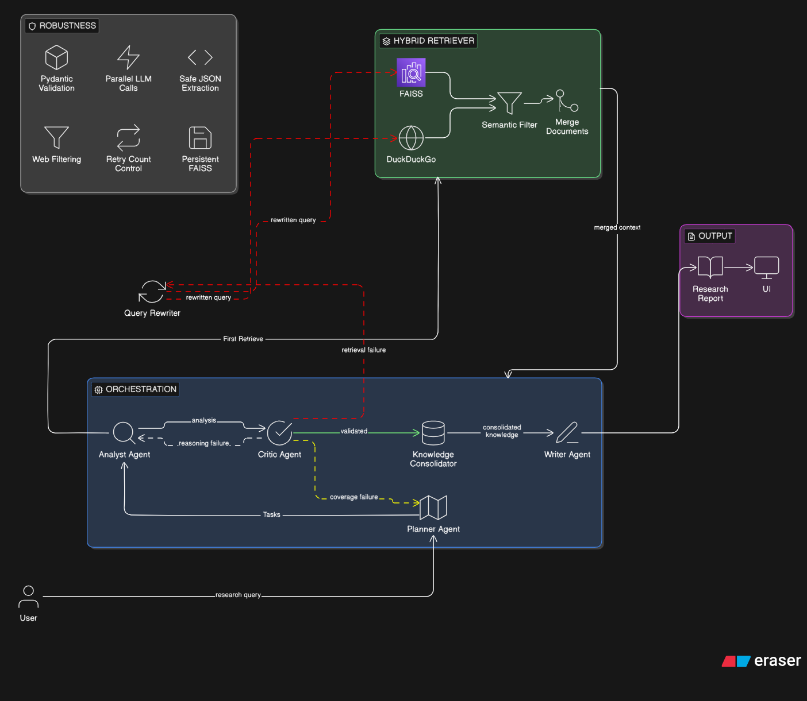

# Multi-Agent Research Assistant

An AI-powered deep research system that utilizes specialized agents to decompose questions, retrieve information from both local vector stores and the web, analyze data for accuracy, and synthesize comprehensive research reports.

## System Overview

This project implements a multi-agent workflow using **LangGraph**,**LangChain**, **FastAPI**, and **React**. It features a robust RAG (Retrieval-Augmented Generation) pipeline using **FAISS** for local document storage and **DuckDuckGo** for real-time web search.

### Multi-Agent Workflow



## Features

- **Specialized Agents**: 
  - **Planner**: Breaks complex questions into actionable research tasks.
  - **Retriever**: Performs hybrid search across local documents and the internet.
  - **Analyst**: Verifies facts and generates per-task insights.
  - **Critic**: Validates the depth and accuracy of the analysis, triggering retries if coverage is insufficient.
  - **Writer**: Compiles the final report with proper citations and markdown formatting.
- **Deep Memory**: Persists verified web insights back into the local FAISS index for future use.
- **Modern UI**: Professional dark-themed React dashboard with real-time research progress and deep analysis visualization.

## Project Structure

- `agents/`: Implementation of individual LLM-powered agents.
- `core/`: Shared infrastructure (LLM config, Vector Store, Schemas).
- `graph/`: LangGraph orchestration and state management.
- `backend/`: FastAPI server setup.
- `frontend/`: React + Vite user interface.
- `data/`: Source documents for local indexing (PDF, TXT, DOCX).
- `faiss_index/`: Persisted vector index.

## Setup Instructions

### Prerequisites
- Python 3.10+
- Node.js & npm
- [Groq API Key](https://console.groq.com/) (configured in `.env`)

### 1. Backend Setup
1. Create and activate a virtual environment:
   ```powershell
   python -m venv .venv
   .venv\Scripts\activate
   ```
2. Install dependencies:
   ```powershell
   pip install -r requirements.txt
   ```
3. Prepare your data:
   - Place documents in the `data/` folder.
   - Run the ingestion script:
     ```powershell
     python ingest.py
     ```
4. Start the FastAPI server:
   ```powershell
   python -m uvicorn main:app --port 8000
   ```

### 2. Frontend Setup
1. Navigate to the frontend directory:
   ```powershell
   cd frontend
   ```
2. Install dependencies:
   ```powershell
   npm install
   ```
3. Start the development server:
   ```powershell
   npm run dev
   ```

## Technologies Used
- **Backend**: Python, LangGraph, FastAPI, LangChain, FAISS, DuckDuckGo Search.
- **Frontend**: React, Vite, Lucide-React, React-Markdown.
- **Models**: Groq (Llama 3.1 8B), HuggingFace Embeddings (all-MiniLM-L6-v2).